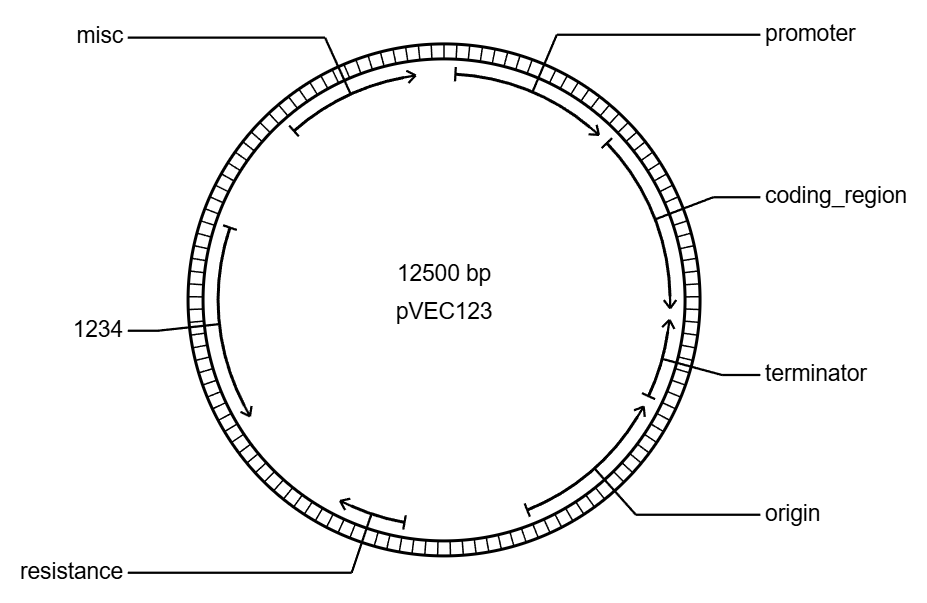

# D3 Vector - DNA Visualization

A React-based circular DNA plasmid visualization tool using D3.js that displays features with directional arrows, labels, and interactive controls.

## Features

- Circular plasmid visualization with concentric circles
- Feature arrows with orientation (sense/antisense)
- Tick marks every 100bp between circles
- Interactive labels with dogleg connectors
- Responsive scaling with intelligent font sizing
- 3:1 aspect ratio for optimal display
- Interactive control panel for adjusting dimensions and data
- PNG export functionality

## Example



*Example visualization of pVEC123 plasmid (12,500 bp) with various features including promoter, coding region, terminator, origin, and resistance markers.*

## Getting Started

1. Install dependencies:
   ```bash
   npm install
   ```

2. Start the development server:
   ```bash
   npm run dev
   ```

3. Open your browser to the URL shown (typically http://localhost:5173)

## Usage

- Adjust **Width** and **Height** using the input fields in the control panel
- Edit the **JSON data** in the textarea to visualize different plasmids
- Click **Download PNG** to export the current visualization

## Data Format

The JSON data file should contain:
- `name`: Plasmid name
- `length`: Total plasmid length in base pairs
- `features`: Array of feature objects with:
  - `start`: Start coordinate
  - `stop`: End coordinate
  - `name`: Feature name
  - `orientation`: "sense" or "antisense"

## Technologies

- React 18
- D3.js v7
- Vite (build tool)
- HTML5 Canvas for image export

## Project Structure

```
d3-vector/
├── src/
│   ├── components/
│   │   └── PlasmidVisualization.jsx  # Main visualization component
│   ├── data/
│   │   └── example_circular.json      # Sample plasmid data
│   ├── css/
│   │   └── styles.css                 # Styles
│   ├── App.jsx                        # Main app with controls
│   └── main.jsx                       # React entry point
├── public/
│   └── data/                          # Public data files
├── index.html                         # HTML entry point
└── package.json                       # Dependencies
```
